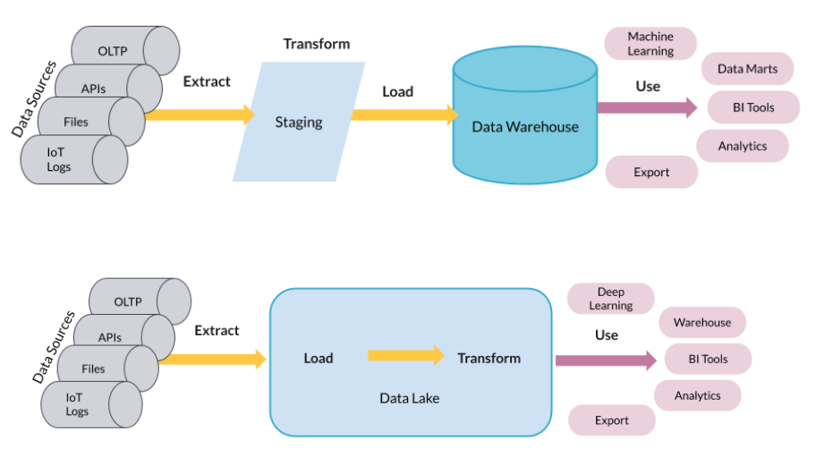

# Database World
All database knowledge you will ever need in one single place!

## Database Managament System
Also known as DBMS, is the software resposible for creating an maintaining the database as well as the interface between users and the data. It is comprised by the database engine, the data schema and the data itself. There are 2 types; SQL DBMS and NoSQL DBMS.

- **SQL DBMS**: Also known as RDBMS, R for Relational, some examples are MSQL Server, PostgreSQL and Oracle. The data structured and unchanging. The schema is defined and consistent.
- **NoSQL DBMS**: Less structured and lacks a well defined schema, allows more flexibility. It is document-centered instead of table-centered. These type of databases are best suited for companies experiencing rapid growth or for storing large quantities of data. There are different types of NoSQL DBMS, depending on how data is stored:

1. Key-Value Store: Comprised by key value pairs, values can be anything. it is commonly used for managing shopping carts for online ecommerce. As an example, Redis.
2. Document Store: Similar to key value store systems. Keys point to documents that shared some common structure. Great choice for content management, blogs, etc. As an example, mongoDB
3. Columnar Database: Stores data in columns instead of rows, this allows scalability and fast reads. This is commonly used for big data and analytical purposes. As an example, Cassandra.
4. Graph Database: Data is interconnected and best represented as a graph. Use cases will be social media apps or recommendations. As an example, neo4j.

## Normalized vs Denormalized
Normalization is process of dividing one big table or flat tables into smaller ones looking for a reduction in redundancy and higher data integrity. Denormalization, on the other hand, is the process of doing the opposite. Transactional databases will be structured in a normalized way since it improves data writing while analitycal databases will be denormalized, hence focusing on reading speed. 

### Normal Forms
Normal forms set normalization rules. Each additional form adds another level of normalization, it goes from the First Normal Form (1NF) being the least normalized up to the Sixth Normal Form (6NF) being the most normalized approach. Most normalized databases stay in the Third Normal Form (3NF).

**First Normal Form (1NF)**
- Each record must be unique - no duplicate rows.
- Each cell must hold one value.

**Second Normal Form (2NF)**
- Must satisfy 1NF.
- Each non-key column must be dependent on all the keys.

**Third Normal Form (3NF)**
- Must satisfy 2NF.
- Non-key columns cannot depend on other non-key columns (No transitive dependencies).

## Processing Data

There are two main different approaches to processing data, OLTP and OLAP.

|OLTP|OLAP|
|---|---|
|Online Transaction Processing|Online Analytical Processing|
|Normalized|Denormalized|
|Better suited for writting data|Better suited for reading data|
|Support daily transactions|Report and analyze data|
|Application oriented|Subject oriented|
|Data is considered up-to-date, operational|Data is consolidated, historical|
|Size goes up to gigabytes(smaller)|Size goes up to terabytes (bigger)|
|Simple transactional queries|Complex aggregated queries|
|Frequent updates|Limited updates|
|Several users|Few users|
|Data is stored in a Operational Database|Data is stored in a Data Warehouse|

## ETL vs ELT

Extract, Transform and Load <> Extract, Load and Transform

<p align="center">
  
</p>

## Storing Data

Data storage could be accomplished in different ways, some common ones are:

- **Structure Data**: Follows a schema, data types and relationships are defined.
- **Unstructured Data**: Schemaless, Makes up most of the data in the world.
- **Semi-structured Data**: Do not follow a larger schema, Self-describing structure (JSON, XML, etc).

Data lakes store data as object, which means the storage is cheaper than traditional databases or data warehouses.

## Partitioning
Partitioning is the process of splitting a huge table in multilpe smaller tables. This is commomnly done to increase reading performance. There are two types of partitioning, vertical, spliting by columns, and horizontal, spliting by rows.

### Horizontal Partitioning
Usualy done by id or some date column.

```
CREATE TABLE flights (
  ...
  flight_date DATE NOT NULL
)
PARTITION BY RANGE (flight_date);

CREATE TABLE flights_2024 PARTITION OF flights
FOR VALUES FROM ('2024-01-01') TO ('2024-12-31');

CREATE INDEX ON flights ('flight_date')
```

## Table vs View vs Materialized View
- **Views**: Is the result of a stored query on the data, it is execued every time the view is run. Views do not store any data. It is just like giving a long query an alias to make it easier execute. Views are used to hide sensitive data and logic giving access to only the right data.
- **Tables**: Stores data in the database. It requieres more thinking since you have to determine relationships, data types, etc. It is useful when you are reading from it several times.
- **Materialized Views**: These views store the weury result on disk, same as a table. The difference and benefit when compared with tables is that materialized views have refresh or rematelializtion parameters that help keeping the data updated.  


## Data Modeling 
Process of creating a data model fo the data to be stored. Common data models are data vault or dimensional modeling. The main objective of these models is to make the reading process more efficient.

There are 3 steps when it comes to creating a model
1. Conceptual data model: Describes entities, relationships and attributes in a high level view. 
2. Logical data model: Defines tables, columns and relationships. 
3. Physical data model: Describes the physical storage. Tables are created in the database.

### Dimensional Modeling
Adaptation of the relational model for data warehouse design. It is optimized for OLAP queries, it is meant to be consumed frequently and updated not so often. This model is also known as star schema. 

Dimensional models are comprised by two types of tables:
- **Fact Tables**: Depend on the business case, are updated frequently and are connected to dimensions via foreign keys. This table holds all the business metrics.
- **Dimension Tables**: Hold description of attributes and does not change that often. 

## :elephant: PostgresSQL

### :gear: Installation

Install PostrgeSQL by running in the terminal: 
```
sudo apt install postgresql
```

Once installed, configure users within the PostgreSQL shell. By default, the host name will be ´localhost´, port ´5432´, database name ´postgres´ and the password is empty. Add or modify user password using the ALTER command.
```
ALTER USER postgres PASSWORD 'root';
```

### :person: Roles

A role is a database object that contains information related to privileges, defining actions such as login & password, creation, read & write, etc. Rolss can be assigned to one or more users. 

There is no underlying difference between groups and users when it comes to roles. A group role 
and user role are the same object, the difference is the number of users it is assigned to. 

```
CREATE ROLE admin WITH CREATEDB CREATEROLE;
CREATE ROLE intern WITH PASSWORD 'Pass123' VALID UNTIL '2025-01-01';
```

Every user/role should have its own database for storing user information and privileges. Create a new user and its own database running the code below.

```
CREATE USER nico WITH CREATEDB LOGIN ENCRYPTED PASSWORD 'nico';
CREATE DATABASE nico;
```

### :: Privileges

Privileges are the permissions granted to users that enable them to perform certain actions, these are: SELECT , INSERT , UPDATE , DELETE , TRUNCATE , REFERENCES , TRIGGER , CREATE , CONNECT , TEMPORARY , EXECUTE , and USAGE . The privileges applicable to a particular object vary depending on the object's type (table, function, etc).


Grant privileges using the grant command
```
GRANT ALL PRIVILEGES ON DATABASE w3schools TO nico;
GRANT ALL PRIVILEGES ON ALL TABLES IN SCHEMA public TO nico;
GRANT SELECT ON ALL TABLES IN SCHEMA public TO nico;
GRANT role_data_analyst TO user_nico;
```

Remove or Revoke privileges with:
```
REVOKE SELECT ON ALL TABLES IN SCHEMA public FROM nick;
REVOKE INSERT ON table_name FROM role;
```

Check given privileges by running this query:
```
SELECT grantor, grantee, table_schema, table_name, privilege_type
FROM information_schema.table_privileges
WHERE grantee = 'user_name_to_check';
```

Run PostgreSQL by typing
```
psql -U postgres -h localhost
```

List server details by running
```
SELECT * FROM pg_settings;
```

Installing pgAdmin4
This software is the helps you manage the server and its databases. It comes in two modes, desktop and web mode. Desktop mode downloads and installs an app in your machine while the web mode installs the app without any user interface, it uses the installed browser.

Install both modes or only one of them running one of the following commands:
```
sudo apt install pgadmin4
sudo apt install pgadmin4-desktop
sudo apt install pgadmin4-web
```

Once the installation process is finished, configure 
The desktop version is configured within the app while the web version is set up in the terminal running the commands below. It will ask for a user name, password (root21) and an apache configuration (answer yes). Finally it will show the url that should be used to access the system, by default it is: http://127.0.0.1/pgadmin4
```
/usr/pgadmin4/bin/setup-web.sh
```

Useful commands in PostgreSQL shell:

- \l: List of databases.
- \du: List of users and roles.
- \d: List of tables in current database.
- \dt: List of tables in current database.
- \dt+: List of tables in current database with additional info.
- \d table_name: Table information.
- \conninfo: Basic details related to the connection: user, database, port
- \q: Exit shell.

Dumping w3schools data
```
CREATE DATABASE w3schools;
\connect w3schools
\i /user_name/Documents/.../data/file.sql
```

### Postgres Admin Tables
- Information Schema
Retrieve all non-system views:
```
SELECT * FROM information_schema.views
WHERE table_schema NOT IN ('pg_catalog', 'information_schema');
```

**Useful Postgres links**
- Official Postgres Documentation: What Not to do [here](https://wiki.postgresql.org/wiki/Don%27t_Do_This)
- Postgres Useful Tips [here](https://challahscript.com/what_i_wish_someone_told_me_about_postgres)

## :duck: DuckDB

### :gear: Installation


Read parquet files directly into the database using `read_parquet('filename')`